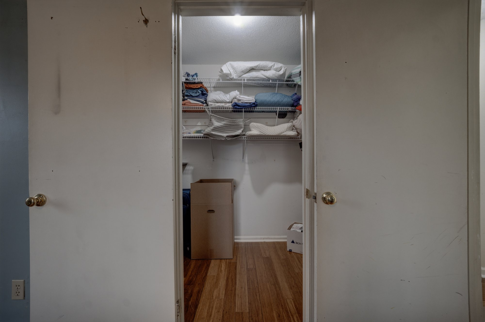

# 🔭 Automatic Lens Distortion Correction — A100-Optimised CNN

> A high-performance deep learning pipeline that automatically corrects lens distortion in real estate and property photography using **EfficientNetB3** and differentiable **Brown-Conrady** undistortion, optimised for NVIDIA A100 GPUs on Google Colab Pro.

📓 **[Open in Google Colab](https://colab.research.google.com/drive/1RO26D6DhnsbDcr367jXr0BHYNNSkFC0E?usp=sharing)**

---

## 📸 Sample Dataset Images

These are real property photographs from the test dataset. Each image exhibits typical wide-angle lens distortion — bowed walls, curved ceilings, warped floor lines — that the model learns to detect and correct.

**Property 1 — 13 Caledonian St, Aberdare**

| Bathroom | Living / Dining |
|:---:|:---:|
|  |  |
| *Barrel distortion visible on tile grid lines* | *Wide-angle warp on ceiling and floor* |

**Property 2 — 105 Boulder Ridge Trail**

| Master Bedroom | Ensuite Bathroom | Hallway |
|:---:|:---:|:---:|
|  |  |  |
| *Bowed carpet and wall geometry* | *Marble tile grid warping* | *Converging wall lines* |

| Open Plan Living | Walk-in Closet |
|:---:|:---:|
|  |  |
| *Bowed hardwood floor lines* | *Warped shelf geometry* |

**Property 3 — Spiro Collection**

| Bathroom Vanity | Dining Room | Walk-in Closet | Bedroom Closet |
|:---:|:---:|:---:|:---:|
|  |  |  |  |
| *Curved granite counter top* | *Wall panel vertical lines bowed* | *Shelving unit warp* | *Door frame barrel effect* |

---

## 🎯 Overview

Lens distortion is a systematic optical imperfection where straight lines in the real world appear curved in photographs — very common in real estate photography where wide-angle lenses are used to make rooms look larger.

This pipeline works in two stages:

- **Stage 1 — Detection:** **EfficientNetB3** examines the distorted photo and predicts 4 distortion coefficients `[k₁, k₂, p₁, p₂]` that describe the lens geometry
- **Stage 2 — Correction:** The **Brown-Conrady mathematical model** uses those 4 numbers to compute exactly where every pixel should be, then remaps it using differentiable bilinear sampling

The CNN never directly manipulates pixels — it only predicts 4 numbers. All pixel manipulation is deterministic mathematics, which means the correction is geometrically principled and resolution-independent.

---

## ✨ Key Features

- **EfficientNetB3 Backbone** — 12M parameter pretrained ImageNet model, native 300×300 input, detects subtle geometric distortion patterns
- **bfloat16 Mixed Precision** — 3× throughput vs float32 on A100, no loss scaling needed
- **XLA JIT Compilation** — 20–40% additional speedup via GPU kernel fusion
- **Differentiable Geometry** — Brown-Conrady undistortion with backprop-safe bilinear sampling
- **Two-Phase Transfer Learning** — frozen backbone → progressive fine-tuning of top 80 layers
- **Three-Component Loss** — SSIM + Sobel Edge + L1 prevents degenerate zero-coefficient solutions
- **Memory-Safe Pipeline** — ~1.3 GB peak RAM via `tf.data` + local SSD streaming
- **Parallel I/O** — `gsutil -m cp` bulk download + native TF decode (15–20× faster than Python GCS clients)

---

## 🏗️ Architecture

```
Distorted Image (384×384)
        ↓
[CNN Encoder — EfficientNetB3]
  • Pretrained ImageNet weights (12M parameters)
  • Global Average Pooling → (1536,)
        ↓
[Regression Head]
  • Dense(512, swish) + Dropout(0.3)
  • Dense(256, swish) + Dropout(0.2)
  • Dense(64,  swish)
  • Dense(4, tanh) + ScaleCoefficients layer
        ↓
  [k₁, k₂, p₁, p₂] — 4 distortion coefficients
        ↓
[Differentiable Brown-Conrady Undistortion]
  • build_distortion_grid()  — XLA compiled
  • bilinear_sample()        — differentiable pixel sampling
        ↓
Corrected Output Image (384×384)
        ↓
Loss = 0.5 × (1 − SSIM) + 0.3 × Sobel Edge + 0.2 × L1
```

### What the 4 Coefficients Mean

| Coefficient | Range | Controls |
|---|---|---|
| `k₁` | `[−1.0, 1.0]` | Primary radial distortion — barrel (negative) or pincushion (positive) |
| `k₂` | `[−0.5, 0.5]` | Secondary radial correction — fixes extreme corner errors |
| `p₁` | `[−0.1, 0.1]` | Tangential distortion — left/right lens tilt |
| `p₂` | `[−0.1, 0.1]` | Tangential distortion — up/down lens tilt |

### Why Three Loss Components?

| Loss | Weight | Purpose |
|---|---|---|
| SSIM | 0.5 | Structural similarity — rewards geometric accuracy |
| Sobel Edge | 0.3 | Edge alignment — prevents zero-coefficient degenerate solution |
| L1 | 0.2 | Pixel accuracy — reduces blur |

---

## ⚙️ Configuration

| Parameter | Value | Notes |
|---|---|---|
| `CNN_INPUT_SIZE` | 300 × 300 | EfficientNetB3 native input |
| `UNDISTORT_SIZE` | 384 × 384 | Higher res = better geometric detail |
| `BATCH_SIZE` | 48 | Tuned for A100 40GB VRAM |
| `EPOCHS` | 30 | Early stopping with patience = 5 |
| `LEARNING_RATE` | 1e-4 | Stable convergence with Adam |
| `PHASE2_START` | Epoch 8 | Unfreeze top-80 backbone layers |
| `PHASE2_LAYERS` | 80 | Number of B3 layers to unfreeze |
| `LOSS_ALPHA` | 0.5 | SSIM weight |
| `LOSS_BETA` | 0.3 | Sobel edge weight |
| `LOSS_GAMMA` | 0.2 | L1 weight |
| `TRAIN_FRACTION` | 1.0 | Use all 23,118 training pairs |

---

## 📈 Performance (A100 Colab Pro)

| Stage | Time |
|---|---|
| GCS bulk download via `gsutil` | ~2–3 min |
| XLA warmup — one-time compile | ~25s |
| Phase 1 training — epochs 1–7, head only | ~8s / epoch |
| Phase 2 training — epochs 8–30, fine-tune | ~18s / epoch |
| Evaluation + ZIP creation | ~1–2 min |
| **Total end-to-end** | **~15–20 min** |

---

## 🚀 Quick Start

### Prerequisites

- Google Colab Pro with **A100 GPU** runtime
- GCP project with access to the GCS bucket containing training/test data
- Python packages: `tensorflow >= 2.14`, `opencv-python`, `scikit-image`, `google-cloud-storage`

---

### Step-by-Step Instructions

**Step 1 — Open the Notebook**

```
https://colab.research.google.com/drive/1RO26D6DhnsbDcr367jXr0BHYNNSkFC0E
```

**Step 2 — Set Runtime to A100**

```
Runtime → Change runtime type → Hardware accelerator → A100 GPU → Save
```

**Step 3 — Authenticate with Google Cloud**

```python
from google.colab import auth
auth.authenticate_user()
```

**Step 4 — Update the Config Section**

Find the `CONFIG` section and fill in your project details:

```python
GCP_PROJECT_ID      = "your-project-id"
GCS_BUCKET_NAME     = "your-bucket-name"
GCS_TRAIN_FULL_PATH = "bucket-name/path/to/training/images/"
GCS_TEST_FULL_PATH  = "bucket-name/path/to/test/images/"
```

**Step 5 — Run All Cells Top to Bottom**

The pipeline runs fully automatically:

| Cell | What it does | Time |
|---|---|---|
| Step 1 | Bulk download via `gsutil -m cp` to local SSD | ~2–3 min |
| Step 2 | Build image helpers and DataFrame | ~10s |
| Step 3 | Differentiable Brown-Conrady undistortion layer | ~5s |
| Step 4 | Build EfficientNetB3 CNN model | ~15s |
| Step 5 | Set up loss functions — SSIM + Sobel + L1 | ~2s |
| Step 6 | Build `tf.data` parallel pipeline | ~5s |
| Step 7 | Two-phase training loop with checkpointing | ~15 min |
| Step 8 | Qualitative evaluation on sample images | ~30s |
| Step 9 | Batched inference on 1,000 test images | ~15s |
| Step 10 | Create ZIP submission + trigger download | ~1 min |

**Step 6 — Download the ZIP**

The file downloads automatically. If it doesn't, run this in a new cell:

```python
from google.colab import files
files.download('/content/lens_correction_cnn_a100.zip')
```

---

## 📂 Data Format

### Training Data (GCS)

```
gs://bucket/path/
├── image_001_original.jpg     ← distorted input
├── image_001_generated.jpg    ← ground truth corrected
├── image_002_original.jpg
├── image_002_generated.jpg
└── ...  (23,118 pairs total)
```

### Test Data (GCS)

```
gs://bucket/path/
├── test_001.jpg
├── test_002.jpg
└── ...  (1,000 images)
```

---

## 📦 Output Files

All outputs saved to `/content/` inside Colab:

```
/content/
├── lens_correction_cnn_a100.zip      ← submission package
├── lens_cnn_model_a100.keras         ← trained model weights
├── training_curves_a100.png          ← loss + SSIM plots per epoch
├── eval_samples_a100.png             ← side-by-side comparisons
└── output/
    ├── outputs/                      ← 1,000 corrected JPEGs
    ├── inputs/                       ← 1,000 original copies
    └── side_by_side/                 ← 1,000 comparison images
```

---

## 🛠️ Tech Stack

| Category | Technology |
|---|---|
| **Deep Learning** | TensorFlow 2.14+, Keras 3 |
| **CNN Backbone** | EfficientNetB3 (pretrained ImageNet) |
| **Computer Vision** | OpenCV, Pillow |
| **GPU Optimisation** | bfloat16 mixed precision, XLA JIT compilation |
| **Data Pipeline** | tf.data, native TF JPEG decode (C++) |
| **Cloud Storage** | Google Cloud Storage, gsutil |
| **Infrastructure** | Google Colab Pro (A100 40GB) |
| **AI Development** | Claude AI (Anthropic) |
| **Language** | Python 3.12 |

---

## 🔧 Troubleshooting

**❌ No GPU detected**
```
Runtime → Change runtime type → Hardware accelerator → A100 GPU → Save
```

**❌ gsutil auth error (exit code 256)**
```python
# Re-run authentication then retry the download cell
from google.colab import auth
auth.authenticate_user()
```

**❌ AssertionError: No training pairs found**
```python
# gsutil mirrors the full GCS path — files may be nested deeper than expected
import glob
files = glob.glob('/content/train_images/**/*.jpg', recursive=True)
print(f"Found {len(files)} files")
print(files[:3])  # check the actual nested path
```

**❌ TypeError: ScaleCoefficients bfloat16 mismatch**
> Keras 3 + XLA can bypass standalone cast layers. Fixed in this repo — `ScaleCoefficients` owns the `tf.cast` internally.

**❌ NotImplementedError: Lambda layer shape inference**
> Keras 3 + bfloat16 cannot infer Lambda layer output shapes. Fixed by replacing all Lambda layers with custom `tf.keras.layers.Layer` subclasses.

**❌ OOM (Out of Memory)**
```python
# Reduce in the CONFIG section
BATCH_SIZE     = 32
UNDISTORT_SIZE = 256
```

---

## 📚 References

- [Brown-Conrady Distortion Model](https://en.wikipedia.org/wiki/Distortion_(optics))
- [EfficientNet: Rethinking Model Scaling](https://arxiv.org/abs/1905.11946)
- [bfloat16 on A100 Tensor Cores](https://cloud.google.com/blog/products/ai-machine-learning/bfloat16-the-secret-to-high-performance-on-cloud-tpus)
- [XLA: Optimizing Compiler for TensorFlow](https://www.tensorflow.org/xla)

---

## 👤 Authors

**Deepthi V** · **Joshua Jose**

*Developed with [Claude AI](https://claude.ai) (Anthropic) for architecture design, debugging, and iterative optimisation.*

---

## 📄 License

[Add your license here]
