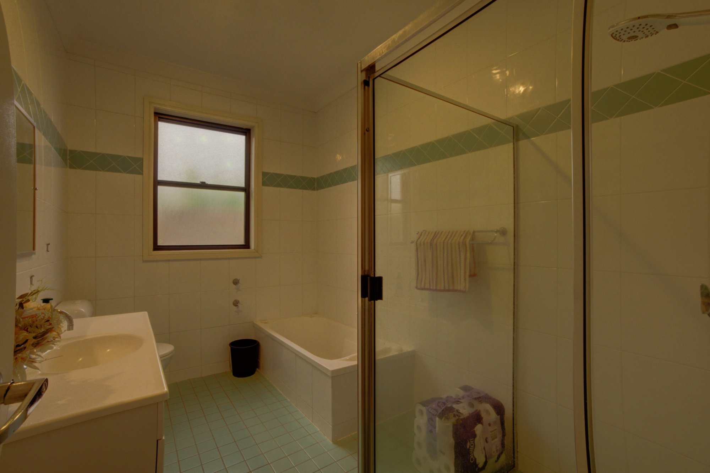
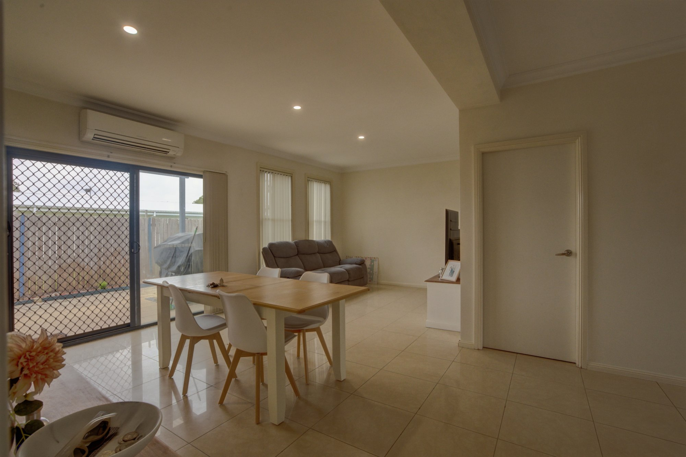
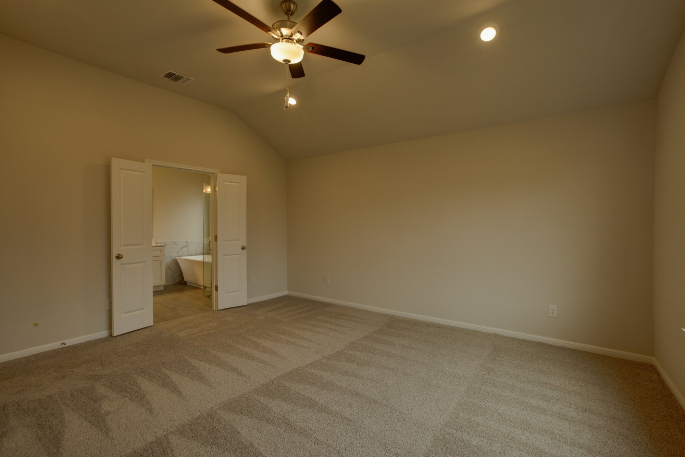
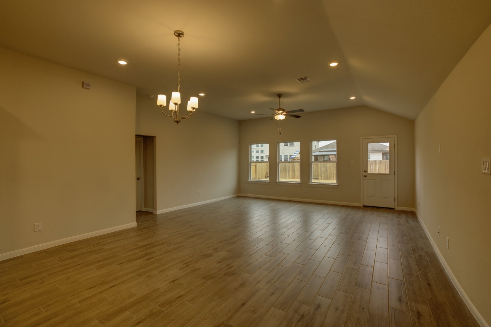
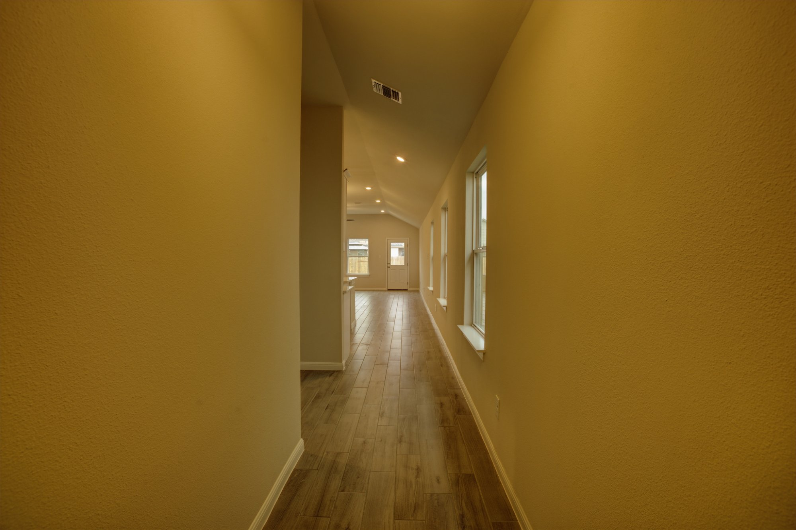
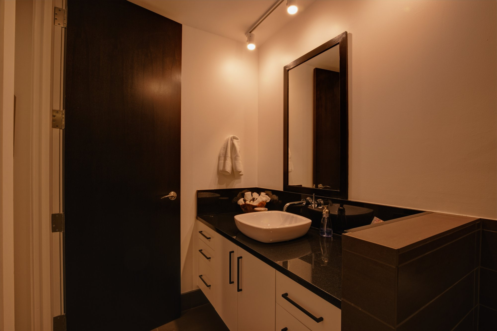
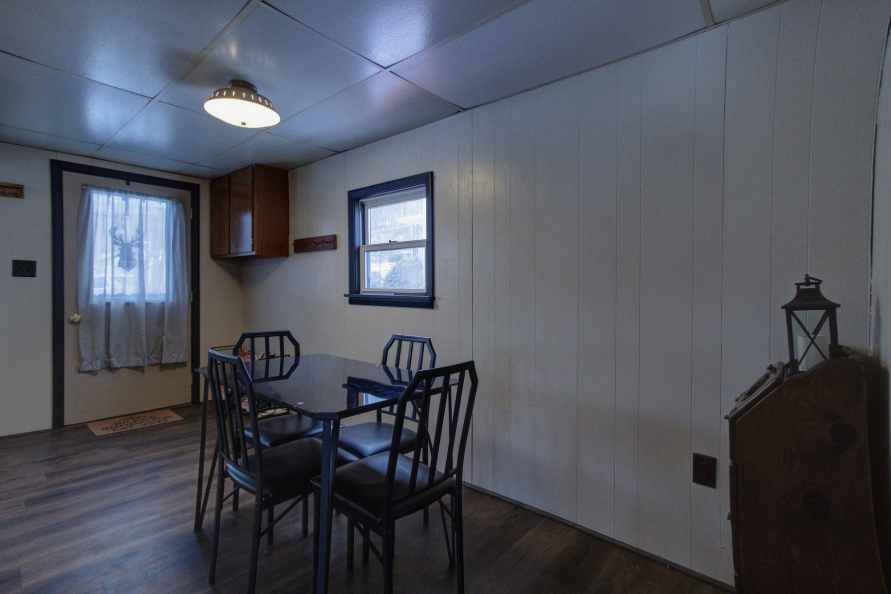
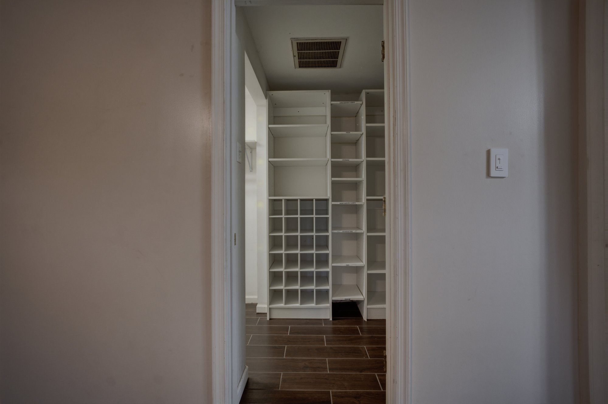

# 🔭 Automatic Lens Distortion Correction — A100-Optimised CNN

> A high-performance deep learning pipeline that automatically corrects lens distortion in real estate and property photography using **EfficientNetB3** and differentiable **Brown-Conrady** undistortion, optimised for NVIDIA A100 GPUs on Google Colab Pro.

📓 **[Open in Google Colab](https://colab.research.google.com/drive/1RO26D6DhnsbDcr367jXr0BHYNNSkFC0E?usp=sharing)**

---

## 📸 Sample Input Images

These are real property photographs from the dataset — each exhibiting typical wide-angle lens distortion (barrel distortion, curved walls, bowed floors) that the model learns to correct.

<table>
  <tr>
    <td align="center"><br/><sub>Bathroom — barrel distortion on tiles</sub></td>
    <td align="center"><br/><sub>Living/Dining — curved ceiling lines</sub></td>
    <td align="center"><br/><sub>Master Bedroom — wide-angle warp</sub></td>
  </tr>
  <tr>
    <td align="center"><br/><sub>Ensuite — marble tile distortion</sub></td>
    <td align="center"><br/><sub>Open Plan Living — floor bow</sub></td>
    <td align="center"><br/><sub>Hallway — perspective distortion</sub></td>
  </tr>
  <tr>
    <td align="center"><br/><sub>Bathroom Vanity — curved counter</sub></td>
    <td align="center"><br/><sub>Dining Room — wall panel warp</sub></td>
    <td align="center"><br/><sub>Walk-in Closet — shelving distortion</sub></td>
  </tr>
</table>

---

## 🎯 Overview

Lens distortion is a systematic optical imperfection where straight lines in the real world appear curved in photographs. This is particularly common in real estate photography where wide-angle lenses are used to make rooms appear larger.

This pipeline:
1. Trains a CNN to **predict distortion coefficients** [k₁, k₂, p₁, p₂] directly from a distorted photo
2. Feeds those 4 numbers into the **Brown-Conrady mathematical model** which computes exactly where each pixel should be
3. **Remaps every pixel** back to its geometrically correct position using differentiable bilinear sampling

---

## ✨ Key Features

- **EfficientNetB3 Backbone** — 12M parameter pretrained ImageNet model, native 300×300 input, superior distortion pattern recognition vs B0
- **bfloat16 Mixed Precision** — 3× throughput vs float32 on A100, no loss scaling needed
- **XLA JIT Compilation** — 20–40% additional speedup via GPU kernel fusion
- **Differentiable Geometry** — Brown-Conrady undistortion with backprop-safe bilinear sampling
- **Two-Phase Transfer Learning** — frozen backbone → progressive fine-tuning of top 80 layers
- **Three-Component Loss** — SSIM + Sobel Edge + L1 prevents degenerate zero-coefficient solutions
- **Memory-Safe Pipeline** — ~1.3 GB peak RAM via tf.data + local SSD streaming
- **Parallel I/O** — gsutil bulk download + native TF decode (15–20× faster than Python GCS clients)

---

## 🏗️ Architecture

```
Distorted Image (384×384)
        ↓
[CNN Encoder]
  • EfficientNetB3 (pretrained ImageNet, 300×300 input)
  • Global Average Pooling → (1536,)
        ↓
[Regression Head]
  • Dense(512, swish) + Dropout(0.3)
  • Dense(256, swish) + Dropout(0.2)
  • Dense(64,  swish)
  • Dense(4, tanh) + ScaleCoefficients
        ↓
[k₁, k₂, p₁, p₂] — distortion coefficients
        ↓
[Differentiable Brown-Conrady Undistortion]
  • build_distortion_grid() — XLA compiled
  • bilinear_sample()      — differentiable
        ↓
Undistorted Image (384×384)
        ↓
Loss = 0.5×(1−SSIM) + 0.3×SobelEdge + 0.2×L1
```

### Predicted Coefficients

| Coefficient | Range | Meaning |
|---|---|---|
| k₁ | [−1.0, 1.0] | Primary radial distortion (barrel/pincushion) |
| k₂ | [−0.5, 0.5] | Secondary radial correction (extreme corners) |
| p₁ | [−0.1, 0.1] | Tangential distortion — x-axis lens tilt |
| p₂ | [−0.1, 0.1] | Tangential distortion — y-axis lens tilt |

---

## ⚙️ Configuration

| Parameter | Value | Notes |
|---|---|---|
| `CNN_INPUT_SIZE` | 300×300 | EfficientNetB3 native input |
| `UNDISTORT_SIZE` | 384×384 | Higher res = better geometric detail |
| `BATCH_SIZE` | 48 | Tuned for A100 80GB VRAM |
| `EPOCHS` | 30 | Early stopping with patience=5 |
| `LEARNING_RATE` | 1e-4 | Stable convergence with Adam |
| `PHASE2_START` | Epoch 8 | Unfreeze top-80 backbone layers |
| `LOSS_ALPHA` | 0.5 | SSIM weight |
| `LOSS_BETA` | 0.3 | Sobel edge weight |
| `LOSS_GAMMA` | 0.2 | L1 weight |
| `TRAIN_FRACTION` | 1.0 | Use full 23,118 training pairs |

---

## 📈 Performance (A100 Colab Pro)

| Stage | Time |
|---|---|
| GCS bulk download (gsutil) | ~2–3 min |
| XLA warmup (one-time) | ~25s |
| Training Phase 1 (epochs 1–7, head only) | ~8s/epoch |
| Training Phase 2 (epochs 8–30, fine-tune) | ~18s/epoch |
| Evaluation + ZIP creation | ~1–2 min |
| **Total end-to-end** | **~15–20 min** |

---

## 🚀 Quick Start

### Prerequisites

- Google Colab Pro with **A100 GPU** runtime
- GCP project with access to the GCS bucket containing training data
- Python packages: `tensorflow >= 2.14`, `opencv-python`, `scikit-image`, `google-cloud-storage`

---

### Step-by-Step Instructions

**Step 1 — Open the Notebook**

Click the Colab badge at the top or open the link directly:
```
https://colab.research.google.com/drive/1RO26D6DhnsbDcr367jXr0BHYNNSkFC0E
```

**Step 2 — Set Runtime to A100**

```
Runtime → Change runtime type → Hardware accelerator → A100 GPU → Save
```

**Step 3 — Authenticate with Google Cloud**

```python
from google.colab import auth
auth.authenticate_user()
```

**Step 4 — Update the Config Section**

Find the `CONFIG` section in the notebook and update:
```python
GCP_PROJECT_ID      = "your-project-id"
GCS_BUCKET_NAME     = "your-bucket-name"
GCS_TRAIN_FULL_PATH = "bucket-name/path/to/training/images/"
GCS_TEST_FULL_PATH  = "bucket-name/path/to/test/images/"
```

**Step 5 — Run All Cells Top to Bottom**

The pipeline runs fully automatically in this order:

| Step | Description | Time |
|---|---|---|
| Step 1 | Bulk download via `gsutil -m cp` to local SSD | ~2–3 min |
| Step 2 | Image helpers and DataFrame construction | ~10s |
| Step 3 | Differentiable Brown-Conrady undistortion layer | ~5s |
| Step 4 | Build EfficientNetB3 CNN model | ~15s |
| Step 5 | Loss functions (SSIM + Sobel + L1) | ~2s |
| Step 6 | tf.data parallel pipeline from local SSD | ~5s |
| Step 7 | Two-phase training loop with checkpointing | ~15 min |
| Step 8 | Qualitative evaluation on 5 sample images | ~30s |
| Step 9 | Batched inference on 1,000 test images | ~15s |
| Step 10 | ZIP submission package + browser download | ~1 min |

**Step 6 — Download Your Submission**

The ZIP downloads automatically. If it doesn't:
```python
from google.colab import files
files.download('/content/lens_correction_cnn_a100.zip')
```

---

## 📂 Data Format

### Training Data (GCS)
```
gs://bucket/path/
├── image_001_original.jpg    ← distorted input
├── image_001_generated.jpg   ← ground truth corrected
├── image_002_original.jpg
├── image_002_generated.jpg
└── ...  (23,118 pairs total)
```

### Test Data (GCS)
```
gs://bucket/path/
├── test_001.jpg
├── test_002.jpg
└── ...  (1,000 images)
```

---

## 📦 Output Files

All outputs saved to `/content/` in Colab:

```
/content/
├── lens_correction_cnn_a100.zip     ← submission package
├── lens_cnn_model_a100.keras        ← trained model weights
├── training_curves_a100.png         ← loss + SSIM plots
├── eval_samples_a100.png            ← side-by-side comparisons
└── output/
    ├── outputs/                     ← 1,000 corrected JPEGs
    ├── inputs/                      ← 1,000 original copies
    └── side_by_side/                ← 1,000 comparison images
```

---

## 🛠️ Tech Stack

| Category | Technology |
|---|---|
| **Deep Learning** | TensorFlow 2.14+, Keras 3 |
| **CNN Backbone** | EfficientNetB3 (pretrained ImageNet) |
| **Computer Vision** | OpenCV, Pillow |
| **GPU Optimisation** | bfloat16 mixed precision, XLA JIT compilation |
| **Data Pipeline** | tf.data, native TF JPEG decode |
| **Cloud Storage** | Google Cloud Storage, gsutil |
| **Infrastructure** | Google Colab Pro (A100 80GB) |
| **AI Development** | Claude AI (Anthropic) |
| **Language** | Python 3.12 |

---

## 🔧 Troubleshooting

**❌ No GPU detected**
```
Runtime → Change runtime type → Hardware accelerator → A100 GPU → Save
```

**❌ gsutil auth error**
```python
# Re-run authentication, then retry the download cell
from google.colab import auth
auth.authenticate_user()
```

**❌ AssertionError: No training pairs found**
```python
# Check what gsutil actually downloaded — files may be nested
import glob
files = glob.glob('/content/train_images/**/*.jpg', recursive=True)
print(f"Found {len(files)} files")
print(files[:3])  # check actual paths
```

**❌ OOM (Out of Memory)**
```python
# Reduce in CONFIG section
BATCH_SIZE     = 32
UNDISTORT_SIZE = 256
```

**❌ NotImplementedError: Lambda layer shape**
> Keras 3 + bfloat16 cannot infer Lambda layer output shapes.
> Already fixed in this repo using `CastToFloat32` and `ScaleCoefficients` custom layers.

---

## 📚 How It Works

The pipeline solves two problems with one architecture:

1. **Detection** — EfficientNetB3 looks at the visual signature of lens distortion (curved walls, bowed floors, warped door frames) and compresses it into 4 numbers [k₁, k₂, p₁, p₂]

2. **Correction** — The Brown-Conrady formula uses those 4 numbers to compute, for every output pixel, exactly where in the distorted input to sample from. Bilinear interpolation fills sub-pixel gaps smoothly.

The key insight is that the CNN never directly manipulates pixels — it only predicts 4 numbers. All pixel manipulation is deterministic mathematics, which means the correction is geometrically principled and works at any resolution.

---

## 📄 References

- [Brown-Conrady Distortion Model](https://en.wikipedia.org/wiki/Distortion_(optics))
- [EfficientNet: Rethinking Model Scaling](https://arxiv.org/abs/1905.11946)
- [bfloat16 on A100 Tensor Cores](https://cloud.google.com/blog/products/ai-machine-learning/bfloat16-the-secret-to-high-performance-on-cloud-tpus)
- [XLA: Optimizing Compiler for TensorFlow](https://www.tensorflow.org/xla)

---

## 👤 Authors

**Deepthi V** · **Joshua Jose**

*Developed with [Claude AI](https://claude.ai) (Anthropic) for architecture design, debugging, and iterative optimisation.*

---

## 📄 License

[Add your license here]
